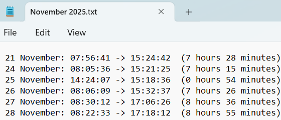

# timesheet-recorder

Lightweight PowerShell script to record the initial logon and final logoff for a specified user each day.

## Requirements

- Windows operating system
- PowerShell 7+
- Elevated (Administrator) privileges

## Usage

### Basic Usage

Run the script manually with your username:

```powershell
.\TimesheetRecorder.ps1 -username "john.doe"
```

Or use the current user (default):

```powershell
.\TimesheetRecorder.ps1
```

For verbose output:

```powershell
.\TimesheetRecorder.ps1 -Verbose
```

### Automated Usage with Task Scheduler

Install the scheduled task to run automatically:

```powershell
# Run as Administrator
.\InstallScheduledTask.ps1
```

Install for a specific user:

```powershell
.\InstallScheduledTask.ps1 -Username "john.doe"
```

Remove the scheduled task:

```powershell
.\InstallScheduledTask.ps1 -Uninstall
```

## Output

Timesheet records are saved to `C:\Users\<username>\Documents\Timesheet Recorder\` in monthly files.

### Example Output



```
17 January: 08:32:15 -> 17:45:22  (9 hours 13 minutes)
18 January: 09:01:44 -> 18:12:08  (9 hours 10 minutes)
```

## How It Works

The script queries Windows Event Logs to determine logon and logoff times.

### Event IDs Queried

| Event ID | Log | Description |
|----------|-----|-------------|
| 4624 | Security | User logon event |
| 4634 | Security | User logoff event |
| 42 | System | System entering sleep |
| 1074 | System | System shutdown initiated |
| 6008 | System | Unexpected shutdown |

### Logon Types Tracked

Only interactive logon sessions are recorded:

| Type | Description |
|------|-------------|
| 2 | Interactive (local keyboard/screen) |
| 7 | Unlock (workstation unlock) |
| 10 | RemoteInteractive (RDP) |
| 11 | CachedInteractive (cached credentials) |

Network logons, service account logons, and batch logons are excluded to ensure only actual user presence is tracked.

## Troubleshooting

### "No logon events found for user"

**Cause:** The Security event log doesn't contain logon events for the specified user today.

**Solutions:**
- Ensure you're running the script with Administrator privileges
- Verify the username is spelled correctly
- Check that "Audit logon events" is enabled in Local Security Policy:
  1. Run `secpol.msc`
  2. Navigate to Local Policies > Audit Policy
  3. Enable "Audit logon events" for Success

### "User profile not found"

**Cause:** The specified username doesn't have a profile folder at `C:\Users\<username>`.

**Solutions:**
- Verify the username matches the folder name in `C:\Users\`
- The user must have logged in at least once to create a profile

### Script runs but shows incorrect times

**Cause:** Multiple users or service accounts may be creating logon events.

**Solutions:**
- The script now filters events by the specified username
- Ensure you're passing the correct username parameter

### Negative or very large duration

**Cause:** Event log corruption or system clock changes.

**Solutions:**
- The script now handles negative durations automatically
- Check system clock settings and time zone configuration

### Missing events / incomplete data

**Cause:** Windows Security logs have limited retention and may roll over.

**Solutions:**
- Increase the Security log size:
  1. Open Event Viewer (`eventvwr.msc`)
  2. Right-click "Security" under Windows Logs
  3. Select Properties
  4. Increase "Maximum log size"
- Run the script more frequently (the scheduled task runs at logon and 11:55 PM)

### "Requires Administrator privileges"

**Cause:** Reading Security event logs requires elevated access.

**Solutions:**
- Right-click PowerShell and select "Run as Administrator"
- For the scheduled task, it's configured to run with highest privileges

## Security Considerations

- The script only reads event logs; it does not modify system settings
- Timesheet files are stored in the user's Documents folder
- No data is transmitted externally
- The scheduled task runs with the user's credentials

## TODO

- [ ] CSV/JSON export format options
- [ ] Weekly/monthly summary reports
- [ ] Break/lunch detection (multiple logon sessions per day)
- [ ] Remote work (RDP) indicator in output

## Disclaimer

I am not a PowerShell expert, far from it. This project was developed with heavy use of AI assistance. Contributions and improvements are welcome!

## License

MIT License - See [LICENSE](LICENSE) file for details.
